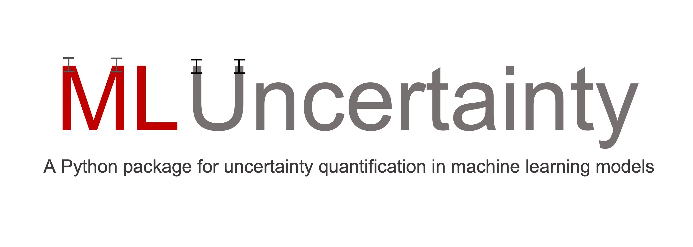

[](https://github.com/architdatar/ml_uncertainty/actions/workflows/run_tests.yml)


=============================

ML Uncertainty is a Python package which provides a scikit-learn-like interface to obtain prediction intervals and model parameter estimation for machine learning models in less than 4 lines of code.

It is build on top of scikit-learn and autograd packages, and is distributed under the MIT license. 

This package has been built by Archit Datar (architdatar@gmail.com). 

Getting started
----
Install from PyPI with
```
pip install ml-uncertainty
```

Intended audience
----
This package is intended to benefit data scientists and ML enthusiasts. 

Motivation
----
* Too often in machine learning, we fit complex models, but cannot quantity their precision via prediction intervals or feature significance.

* This is especially true of the scikit-learn environment which is extremely easy to use but does not offer these functionalities.

* However, in many use cases, especially where we have small and fat datasets, these are insights are critical to produce reliable models and insights. 

* Enter ML Uncertainty! This provides an easy API to get all these insights from models.

* It takes scikit-learn fitted models as inputs and uses appropriate statistics to quantify the uncertainties in ML models.

Computing stats as easy as:

```Python
# Set up the model inference.
inf = ParametricModelInference()
inf.set_up_model_inference(X_train=X, y_train=y, estimator=regr)

# Get parameter importance estimates.
df_imp = inf.get_parameter_errors()

# Get prediction intervals.
df_int = inf.get_intervals(X)
```

Features
--------

1. **Model parameter significance testing:** Tests whether the given model parameters are truly significant or not.

     For ensemble models, it can inform if given features are truly important or if they just seem so due to the instability of the model.

2. **Prediction intervals:** Can produce prediction and confidence intervals for parametric and non-parametric ML models.

3. **Error propagation:** Propagates error from input / model parameters to the outputs.

4. **Non-Linear regression:** Scikit-learn-style API to fit non-linear models. 

Installation
------------
### Dependencies
Python versions: See badges above.\
Packages: See [requirements.txt](./requirements.txt).

### User installation
See [./docs/installation.md](/docs/installation.md).

## Examples
To run the [examples](examples), some additional plots and calculations need to be made which require other packages. These can be installed using:
```
pip install matplotlib seaborn jupyter scikit-fda
```

Check out some of the these [examples](examples) to try out the package. These examples are best run in [VS code](https://code.visualstudio.com/). 
* [Non-linear regression example with a quadratic model](examples/non_linear_regression_quadratic.py)
* [Non-linear regression example with an Arrhenius model](examples/non_linear_regression_arrhenius.py)
* [Parametric model inference with Arrhenius model](examples/parametric_model.py)
* [Error Propagation with Arrhenius model](examples/error_propagation.py)
* [Model inference for a random forest regressor model](examples/ensemble_model.py)


## Theoretical foundations

Discussion about the theory used can be found here:

* [Parametric models](docs/theory/parametric_models.md)
* [Ensemble models](docs/theory/ensemble_models.md)


## Benchmarking
`NonLinearRegression`, `ParametricModelInference`, and `ErrorPropagation` classes have been benchmarked against the Python [statsmodels](https://www.statsmodels.org/stable/index.html) package. The codes for this can be found [here](tests/benchmarking/). 

To run these benchmarking codes, please install statsmodels using:
```
pip install statsmodels==0.14.0
```

The `EnsembleModelInference` does not have a code to benchmark it against to the best of my knowledge. However, the code follows the ideas developed in the work by [Zhang et al. (2020)](https://www.tandfonline.com/doi/abs/10.1080/00031305.2019.1585288?journalCode=utas20). The test is that a $(1-\alpha)\times100$ % prediction interval must contain $(1-\alpha)$ proportion of the training data. See benchmarking codes [here](tests/benchmarking/). 


Credits
-------

1. This package was created with Cookiecutter_ and the `audreyr/cookiecutter-pypackage`_ project template.

    [Cookiecutter](https://github.com/audreyr/cookiecutter)

    [`audreyr/cookiecutter-pypackage`](https://github.com/audreyr/cookiecutter-pypackage)

2. Some functions in `ParametricModelInference` are adopted from a [Github repo](https://github.com/sriki18/adnls/) by sriki18.
